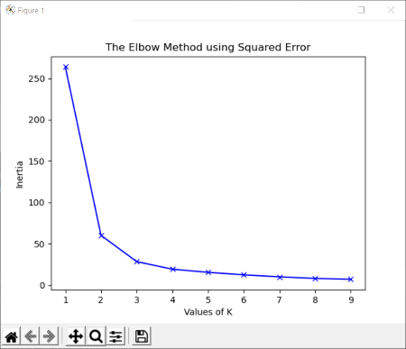
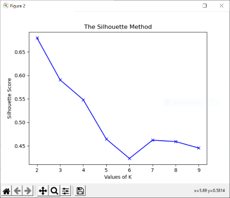

# ACM Research Coding Challenge (Fall 2020)

## No Collaboration Policy

**You may not collaborate with anyone on this challenge.** You _are_ allowed to use Internet documentation. If you _do_ use existing code (either from Github, Stack Overflow, or other sources), **please cite your sources in the README**.

## Submission Procedure

Please follow the below instructions on how to submit your answers.

1. Create a **public** fork of this repo and name it `ACM-Research-Coding-Challenge`. To fork this repo, click the button on the top right and click the "Fork" button.
2. Clone the fork of the repo to your computer using . `git clone [the URL of your clone]`. You may need to install Git for this (Google it).
3. Complete the Challenge based on the instructions below.
4. Email the link of your repo to research@acmutd.co with the same email you used to submit your application. Be sure to include your name in the email.

## Question One

 
Given the following dataset in `ClusterPlot.csv`, determine the number of clusters by using any clustering algorithm. **You're allowed to use any Python library you want to implement this**, just document which ones you used in this README file. Try to complete this as soon as possible.

Regardless if you can or cannot answer the question, provide a short explanation of how you got your solution or how you think it can be solved in your README.md file.

## Explanation

While researching methods for finding the optimal number of clusters for a given dataset, I came across the Elbow Method and the Silhouette method, both of which I've implemented. The Elbow method works by iteratively running a K-Means clustering algorithm to find the optimal k (# of clusters), where k is usually 1-10. For each KMeans model, the sum of the square of the distances between each point and their predicted center is calculated. I plotted that data. 

 

The plot shows that the difference in the sum of the squared error decreases rapidly at k=2 and after. This suggests that the number of clusters is 2. 

I also implemented the silhouette method using the silhouette score function in the sklearn package for the KMeans models with more than 2 clusters and plotted that data as well. This method is used to support the results of the elbow method, especially if the squared error method doesn't provide a definite optimal k value.

 

The number of clusters is at the peak of the graph, which on this plot, is clearly at k=2. 

I used the sklearn, numpy, and matplotlib.pyplot libraries.

## Solution
Number of clusters is 2.

## Sources
https://www.geeksforgeeks.org/elbow-method-for-optimal-value-of-k-in-kmeans/
https://medium.com/analytics-vidhya/how-to-determine-the-optimal-k-for-k-means-708505d204eb

